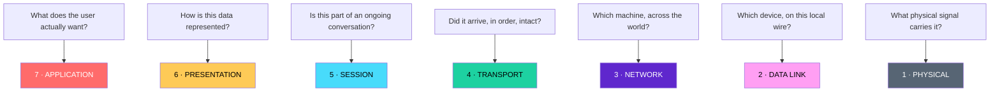
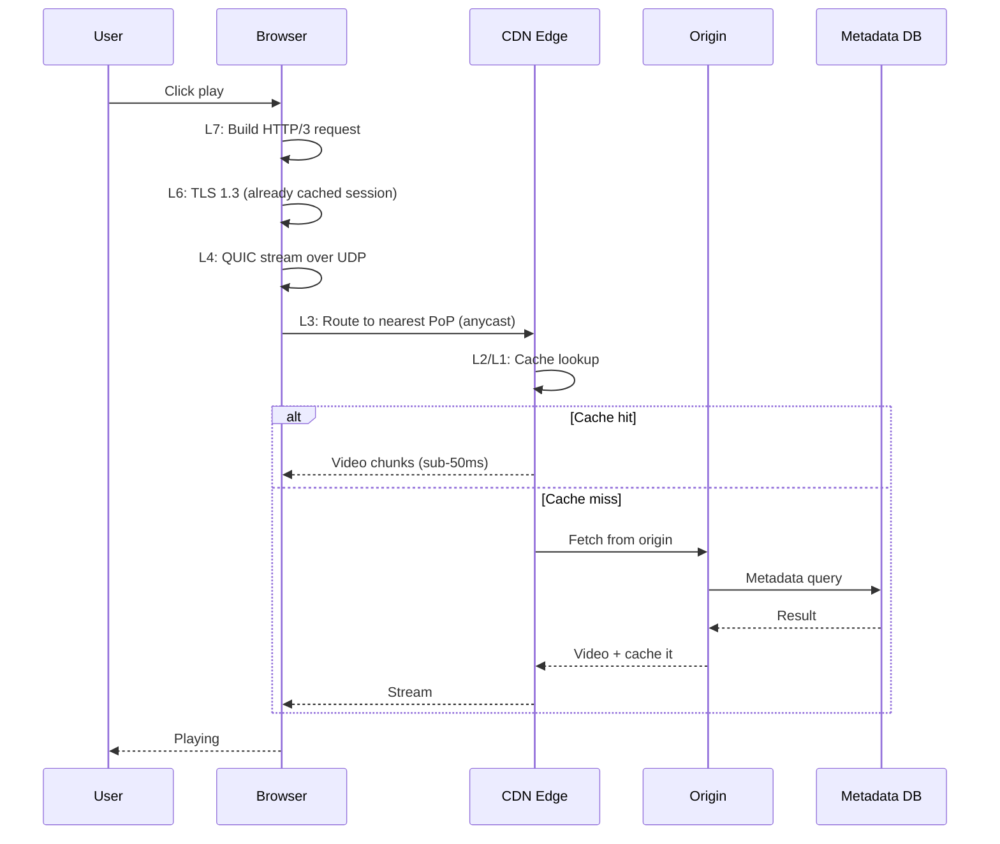
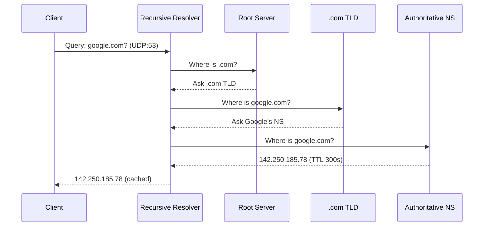
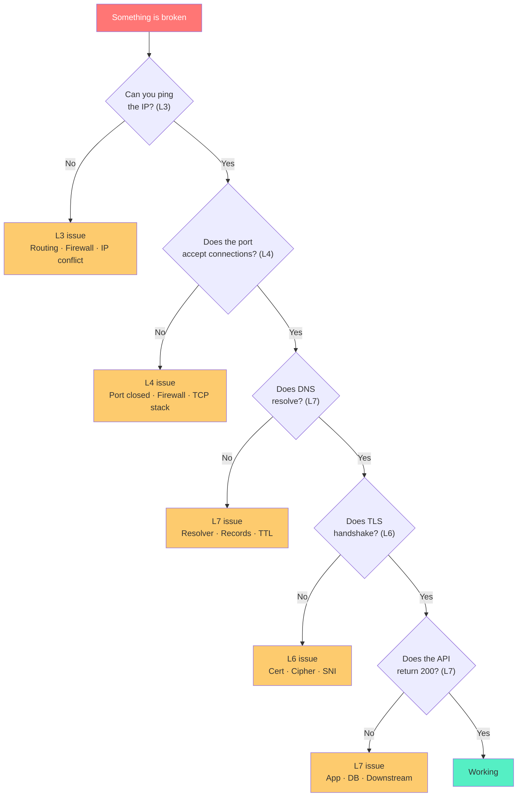
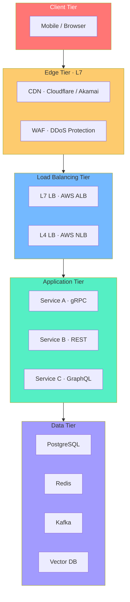

# The OSI Model

## Table of Contents

- [The Real Model](#the-real-model)
- [Encapsulation: The One Concept That Unlocks Everything](#encapsulation-the-one-concept-that-unlocks-everything)
  - [The naming matters more than you think](#the-naming-matters-more-than-you-think)
- [The Layers, Done Properly](#the-layers-done-properly)
  - [Layer 7 — Application](#layer-7-application)
  - [Layer 6 — Presentation](#layer-6-presentation)
  - [Layer 5 — Session](#layer-5-session)
  - [Layer 4 — Transport](#layer-4-transport)
  - [Layer 3 — Network](#layer-3-network)
  - [Layer 2 — Data Link](#layer-2-data-link)
  - [Layer 1 — Physical](#layer-1-physical)
- [Use Case Traces — Real Systems, Layer by Layer](#use-case-traces-real-systems-layer-by-layer)
  - [4.1 Loading a YouTube video](#41-loading-a-youtube-video)
  - [4.2 A single DNS lookup](#42-a-single-dns-lookup)
  - [4.3 A multiplayer game tick](#43-a-multiplayer-game-tick)
- [Diagnostics: The OSI X-Ray](#diagnostics-the-osi-x-ray)
  - [The tool map](#the-tool-map)
- [System Design Through the OSI Lens](#system-design-through-the-osi-lens)
  - [6.1 Where each layer lives in a modern stack](#61-where-each-layer-lives-in-a-modern-stack)
- [The Master's Lens](#the-masters-lens)
- [Appendix: Quick Reference](#appendix-quick-reference)
  - [The Seven Questions](#the-seven-questions)
  - [The Vocabulary Chain](#the-vocabulary-chain)
  - [The Tool Map](#the-tool-map)
  - [The Core Principle](#the-core-principle)

---

## The Real Model


Forget "7 layers" for a second. Here's what OSI actually is:


> **Every piece of data traveling across any network must answer seven questions, in order. OSI is just the ordered list of those questions.**


That's it. Seven questions. Each one has a "layer" that answers it.





Ask **What problem does this layer solve?**

Then each layer makes sense - it exists because without it, some problem can’t be solved.


| Layer | Without it... |

|-------|---------------|

| L1 | Nothing physically moves |

| L2 | Two devices on the same wire can't agree on who's talking |

| L3 | You can never leave your local network |

| L4 | You can't tell "arrived" from "lost," or "this app" from "that app" on the same machine |

| L5 | Every request is a stranger; no conversations, no state |

| L6 | Encryption, compression, encoding — all chaos |

| L7 | Nothing meaningful happens |


---


## Encapsulation: The One Concept That Unlocks Everything


If you only take one thing from this blog, take this.


When you send data, it doesn't jump across the network as is. It gets **wrapped**, layer by layer. Each layer adds its own header (sometimes a trailer) - metadata the receiving side will use to unwrap.

```mermaid

graph LR

    subgraph DOWN["Sender — Data flows DOWN"]

        A["Application data<br/><i>Hello</i>"]

        B["+ TCP header<br/><b>[Port | Seq | Hello]</b>"]

        C["+ IP header<br/><b>[IP | Port | Seq | Hello]</b>"]

        D["+ Frame header/trailer<br/><b>[MAC | IP | Port | Seq | Hello | CRC]</b>"]

        E["Physical bits<br/><b>1010110100...</b>"]

        A --> B --> C --> D --> E

    end


    subgraph UP["Receiver — Data flows UP"]

        F["Bits arrive"]

        G["Frame verified · MAC matched"]

        H["Packet verified · IP matched"]

        I["Segment reassembled · ACK sent"]

        J["Application reads <i>Hello</i>"]

        F --> G --> H --> I --> J

    end


    E -.->|"The wire"| F


    style DOWN fill:#ffeaa7

    style UP fill:#55efc4

```





The genius of this design: **each layer only needs to understand its own header.** The IP layer doesn't care if you're sending JSON or a JPEG. TCP doesn't care if you're talking to Google or GF. This separation is why the internet scaled from 4 nodes to 5 billion devices without a redesign.


### The naming matters more than you think


Each layer's wrapped unit has a name — and these names are used in RFCs, tools, and incident reports. Learn them once:


| Layer | Unit name | Typical size |

|-------|-----------|--------------|

| 7–5 | Data / Message | Application-defined |

| 4 | Segment (TCP) · Datagram (UDP) | Up to ~1460 bytes payload |

| 3 | Packet | Up to 65,535 bytes |

| 2 | Frame | Up to 1500 bytes (MTU) |

| 1 | Bit / Symbol | 1 or a few |


When someone says "we're seeing packet loss," they mean L3. When they say "frame errors on the switch," that's L2. **Vocabulary is diagnosis.**


---


## The Layers, Done Properly


I'm going to move through each layer with the same lens: **what problem it solves, what protocols live there, what products you've heard of, and how it fails.** Failure modes are the real education.


### Layer 7 — Application


**Solves:** *What does the user actually want to accomplish?*


This is where protocols that carry meaning live. HTTP, DNS, SMTP, SSH, FTP, gRPC, WebSocket, MQTT, and hundreds more. Each one is a **contract** — a shared language between two programs.


**Real products:** Nginx, HAProxy, Cloudflare, AWS Application Load Balancer, Envoy, Kong.


**How it fails:** `502 Bad Gateway` (upstream is broken), `504 Gateway Timeout` (upstream is too slow), `404` (the app says it doesn't exist), malformed JSON, rate-limit `429`. Every HTTP status code is an L7 statement.


**The subtle part most people miss:** L7 is where *business logic* becomes visible on the wire. A load balancer that "understands" HTTP can route `/api/v1/*` to one service and `/images/*` to another. An L4 balancer cannot do this — it never sees the URL. This distinction is worth millions in cloud bills.


---


### Layer 6 — Presentation


**Solves:** *How is this data represented so both sides agree?*


Encryption, compression, character encoding, serialization formats. TLS is the celebrity here, but so are JSON, Protobuf, MessagePack, JPEG, MP4, gzip, zstd, UTF-8.


**Real products:** OpenSSL, BoringSSL, Let's Encrypt, Cloudflare's image resizing, Cloudinary, brotli.


**How it fails:** Expired certificates, TLS handshake failures, incompatible cipher suites, garbled text from encoding mismatch, images that render as broken icons.


**Why this layer is quietly the most dangerous:** A TLS misconfiguration takes down *everything* above it. A compression bug can leak secrets (see CRIME, BREACH attacks). Presentation is where "it works" and "it's catastrophically insecure" look identical from the outside.


---


### Layer 5 — Session


**Solves:** *Is this request part of an ongoing conversation, or a fresh start?*


Session establishment, maintenance, teardown, and checkpointing. In practice, this layer is often absorbed into L7 (HTTP cookies, JWT) or L4 (TCP connections), but conceptually it's distinct: it's about **state across multiple exchanges**.


**Real products:** Socket.io, gRPC streams, WebRTC, Auth0 sessions, Redis session stores, sticky-session load balancers.


**How it fails:** "Session expired, please log in again." Sticky-session routing sending a user to the wrong backend. WebRTC streams that reconnect on every network blip. A logout that doesn't invalidate the server-side session.


**The design tension:** Sessions are cheap to maintain and expensive to scale. Every horizontal-scaling architecture eventually confronts this — do you store sessions server-side (stateful) or push state to the client (stateless, JWT)? Both are L5 decisions with L4 and L7 consequences.


---


### Layer 4 — Transport


**Solves:** *Did it arrive, in order, intact — and which application does it belong to?*


This is the delivery layer. It's where **ports** live (so the same machine can run a web server, a database, and an SSH daemon simultaneously), and where **reliability** is decided.


The two protagonists:


- **TCP** — connection-oriented, ordered, reliable, with flow control and congestion control. Used by HTTP/1.1, HTTP/2, SMTP, SSH, databases.

- **UDP** — fire-and-forget, minimal, no ordering, no retransmission. Used by DNS, VoIP, gaming, video streaming, and — crucially — QUIC.


**And then there's QUIC.** This deserves its own sentence because it's quietly rewiring the internet. QUIC is a transport protocol built *on top of* UDP that implements everything TCP does (reliability, ordering, congestion control) but with multiplexed streams, 0-RTT handshakes, and built-in TLS 1.3 encryption. HTTP/3 is QUIC. Google, Cloudflare, and Meta run it at massive scale. When you see a YouTube video start instantly, QUIC is often why.


**Real products:** the Linux TCP stack, Cloudflare's quiche, Google's cronet, Nginx, Envoy, AWS Network Load Balancer.


**How it fails:** "Connection timed out" (TCP handshake never completed), "Connection reset by peer" (RST received), port blocked by a firewall, MTU black holes where large packets silently die.


**Why this layer is the engineer's favorite:** It's the last layer you can reason about *purely* — without business logic, without user intent. If L4 is clean and L7 is broken, you know exactly where to look.


---


### Layer 3 — Network


**Solves:** *Which machine, across the world, and what path gets us there?*


IP addresses, routing, path selection. This is where the internet actually *is* an internet — a network of networks. BGP (Border Gateway Protocol) is the protocol that stitches together every ISP, every cloud, every content provider. When BGP has a bad day, countries disappear from the internet.


**Real products:** Cisco, Juniper, Arista routers, AWS Transit Gateway, Google Cloud Interconnect, AWS Global Accelerator, any BGP-speaking AS.


**How it fails:** "Destination host unreachable," traceroute showing packets dying at a specific hop, asymmetric routing (traffic goes out one path, comes back another — often fine, sometimes catastrophic for firewalls), route flapping, BGP hijacks.


**The uncomfortable truth:** You don't control L3. The internet is a *cooperative agreement* between thousands of autonomous systems, and any one of them can misconfigure their router and break your service for a country. This is why CDNs exist — to shorten the path and reduce the number of untrusted hands your packets pass through.


---


### Layer 2 — Data Link


**Solves:** *Which device, on this local wire, should receive this?*


MAC addresses, framing, error detection (CRC), and local delivery. Every Ethernet frame, every WiFi frame, every VLAN tag lives here. This is the layer of switches, not routers.


**Real products:** Arista and Cisco switches, WiFi access points, AWS VPC ENIs, Cumulus Linux, VLANs, VXLAN overlays, MPLS.


**How it fails:** MAC address flapping (a MAC appears on two switch ports — usually a loop), VLAN misconfiguration (traffic silently dropped), ARP storms, duplex mismatch (one side thinks it's full-duplex, the other half — slow but functional, the worst kind of bug).


**The layer everyone forgets until it's the problem:** L2 issues are the hardest to diagnose because they're often *silent*. A misconfigured VLAN doesn't throw an error. It just... doesn't deliver. You see packets leave, and nothing arrives. Wireshark is your only friend.


---


### Layer 1 — Physical


**Solves:** *What physical signal carries this, and can the receiver tell 0 from 1?*


Copper, fiber, radio. Voltages, wavelengths, modulation schemes. The dirt and the photons.


**Real products:** Corning and Prysmian fiber, Cat6/Cat7 cabling, DWDM optics (400G, 800G), Starlink's radio link, AWS Direct Connect, undersea cables.


**How it fails:** Cable unplugged, fiber cut (a single backhoe in Virginia takes down half the internet — this has happened), signal attenuation over long distances, interference on wireless, bad SFP modules.


**Why it still matters in a cloud world:** The physical layer is where *latency physics* lives. Light in fiber travels ~200,000 km/s. New York to London is ~5,600 km — so round-trip, that's ~56 ms *minimum*, no matter how good your software is. Every CDN, every edge compute offering, every "multi-region active-active" architecture is fundamentally a negotiation with L1 latency.


---


## Use Case Traces — Real Systems, Layer by Layer


Theory is cheap. Let's walk through real flows and watch the layers dance.


### 4.1 Loading a YouTube video





**What to notice:** Every layer is doing something essential. The anycast routing at L3 sends you to the *nearest* CDN edge — not the "correct" one in a DNS sense, just the geographically closest. QUIC at L4 gives you 0-RTT resumption so re-opening the tab doesn't cost a handshake. TLS at L6 is already negotiated. This is why YouTube feels instant.


### 4.2 A single DNS lookup





**What to notice:** DNS is a *recursive* protocol — each server only knows the next step, not the final answer. The 300-second TTL is the L7 contract that lets caching work. Without TTLs, every DNS query would hit the root servers, and the internet would collapse under its own weight.


### 4.3 A multiplayer game tick


A 60-tick-per-second shooter sends ~60 UDP packets per second per player. Each packet contains: player position, velocity, actions.


- **L4: UDP, not TCP.** A lost position update 100ms ago is *worthless*. Retransmitting it would delay the next update, making lag worse. UDP wins because stale data is worse than missing data.

- **L3:** The game server IP is often *anycast* — the player connects to the nearest edge, which tunnels to the authoritative game server.

- **L7:** Custom binary protocol. JSON would be 10x too slow.


**The lesson:** "Reliable" isn't always better. Protocol choice is a *product* decision, not a network one.


---


## Diagnostics: The OSI X-Ray


This is where OSI earns its keep. When something breaks, you don't guess — you **walk the stack**.





### The tool map


| Layer | Tool | What it tells you |

|-------|------|-------------------|

| L7 | `curl -v`, browser DevTools, `dig`, `nslookup` | App response, DNS resolution |

| L6 | `openssl s_client`, Wireshark (with keylog) | TLS handshake, cert validity |

| L5 | `ss`, `netstat`, app logs | Session state, connection count |

| L4 | `nc`, `nmap`, `tcpdump`, `ss` | Port reachability, retransmits |

| L3 | `ping`, `traceroute`, `mtr`, `ip route` | Path, latency, packet loss |

| L2 | `arp -a`, `ifconfig`, switch CLI | MAC, frame errors |

| L1 | `ethtool`, OTDR, cable tester | Link status, signal quality |


**The two golden rules of troubleshooting:**


1\. **Bottom-up** when you suspect infrastructure (start at L1, walk up).

2\. **Top-down** when you suspect the app (start at L7, walk down).


Most production incidents are resolved faster with top-down, because the app is *usually* the culprit. But when the app looks fine and nothing works, bottom-up is the only path.


---


## System Design Through the OSI Lens


Here's where OSI stops being a networking concept and becomes an **architecture tool**.


### 6.1 Where each layer lives in a modern stack





**The critical design question at each tier:**


- **Edge (L7):** Do you need request-aware routing, or just fast termination? Cloudflare vs. plain DNS.

- **Load balancer (L4 vs. L7):** L4 LBs are faster and protocol-agnostic but blind to HTTP semantics. L7 LBs see everything but cost more CPU. Most architectures use both — L4 at the edge, L7 inside.

- **App tier (L7):** REST for public APIs (cacheable, human-readable), gRPC for internal services (fast, typed, streaming), GraphQL when clients need flexibility.

- **Data tier (L4):** Databases speak their own protocols over TCP. Connection pooling is an L4 concern. Kafka is its own protocol entirely.


---


## The Master's Lens


You've read the layers, the traces, the diagnostics, the designs. Here's how to *use* all of it.


**When something breaks, ask:** Which layer's *question* is being answered wrong?


- User can't reach the site → L7 DNS? L3 routing? L4 port? L1 link?

- Latency is high → L3 path? L4 retransmits? L6 handshake? L7 app code?

- Data is corrupted → L2 CRC? L6 encoding? L7 serialization?

- Security incident → L6 TLS misconfig? L7 injection? L3 spoofing?


**When you design a system, ask:** What layer does each component operate at, and what does that buy me?


- L4 load balancer: fast, protocol-blind.

- L7 load balancer: slower, HTTP-aware.

- L6 sidecar: encryption without app changes.

- L7 service mesh: retries, tracing, traffic shifting.


**When you scale, ask:** Which layer is the bottleneck?


- More traffic → L4/L7 horizontal scaling.

- More regions → L3 routing, L4 replication.

- More GPU → L1 bandwidth, L2 topology.

- More services → L7 API design, L6 security.


**The final insight:** OSI is not a test you pass. It's a **shared vocabulary** that lets a student, an SRE, an architect, and a CTO argue about the same problem without talking past each other. Every incident postmortem, every design review, every "why is this slow" conversation becomes clearer when everyone agrees on which layer they're discussing.


That's the mastery. Not memorizing seven words — **seeing seven questions, always, in every system you touch.**


---


## Appendix: Quick Reference


### The Seven Questions


| # | Question | Layer |

|---|----------|-------|

| 1 | What does the user want? | L7 · Application |

| 2 | How is the data represented? | L6 · Presentation |

| 3 | Is this an ongoing conversation? | L5 · Session |

| 4 | Did it arrive, intact, in order? | L4 · Transport |

| 5 | Which machine, globally? | L3 · Network |

| 6 | Which device, locally? | L2 · Data Link |

| 7 | What physical signal? | L1 · Physical |


### The Vocabulary Chain


```

Data → Segment/Datagram → Packet → Frame → Bits

(L7-5)      (L4)            (L3)    (L2)   (L1)

```


### The Tool Map


| Layer | Tools |

|-------|-------|

| L7 | `curl`, `dig`, DevTools |

| L6 | `openssl`, Wireshark |

| L5 | `ss`, `netstat` |

| L4 | `nc`, `nmap`, `tcpdump` |

| L3 | `ping`, `traceroute`, `mtr` |

| L2 | `arp`, `ifconfig` |

| L1 | `ethtool`, OTDR |


### The Core Principle


> **Encapsulate going down. Decapsulate going up. Every hop. Every time. Everywhere.**


---


*If you made it here, you don't need to "study OSI" anymore. You already see it.*


---
